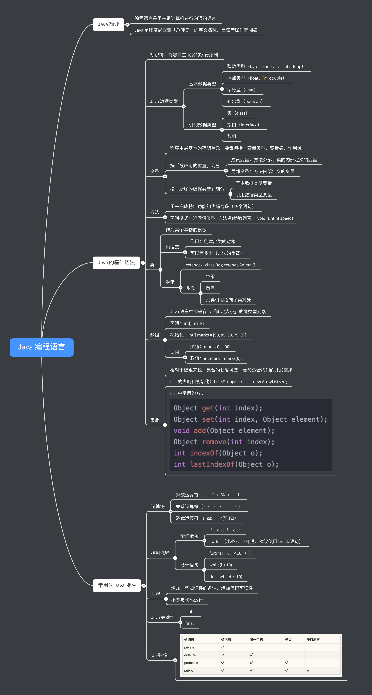

# Introduction

写这本书的目的，主要是为了让 Larissa 更方便地查看我教过她的内容，可以随时进行浏览，而且通过搜索功能，也能更快找到对应的内容。

这本书主要包括三部分：

* Java 编程语言
* Android 开发知识
* 编程相关的其他知识

Java 部分已经基本学完了，通过幕布做了一个思维导图，方便以后复习

PS：这里贴上幕布的协作连接：[https://mubu.com/colla/2ggvCCrQff](https://mubu.com/colla/2ggvCCrQff)

Android 部分，是在 Java 语言的基础上进行拓展，通过 Java 和 XML 来开发 Android App，并在学 Android 开发的过程中，穿插一些 Android 相关的有趣的知识，如：

* Android 的版本历史（通过字母表的顺序和食物来命名）
* Android 的系统权限
* Android App 的各种现象

等学完 Android 开发的基本知识之后，打算让 Larissa 从零开始敲一个综合性比较强的 Android App，一步步将之前学的东西都串起来，从而对编程有一个整体的感知。

除了编程语言和相关的应用开发之外，在编程领域其实还有很多好玩的东西，例如这本电子书的完成，就涉及到很多编程方面的知识。

* GitBook = Git + MarkDown

编程是一件很有意思的事情，也是值得学一辈子的事情。

