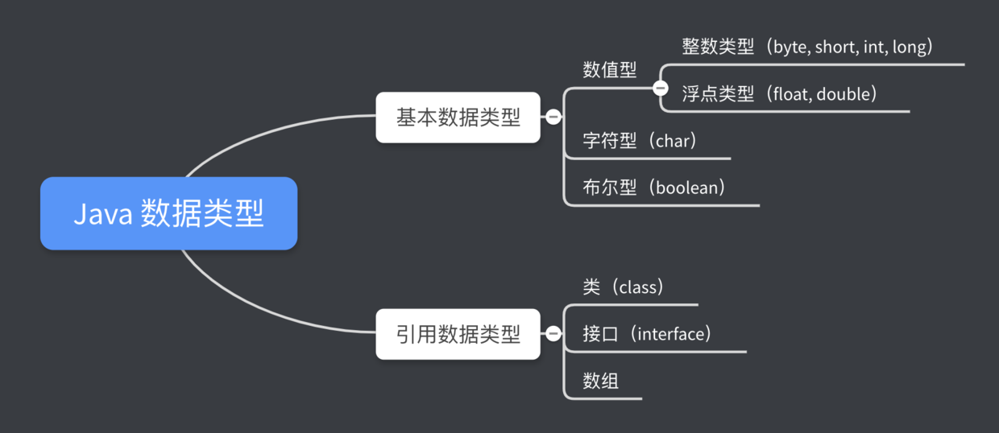

# 数据类型和运算符

## Java 数据类型



### **boolean 类型**

boolean 类型适于逻辑运算，一般用于程序流程控制，只允许取值 true 或 false

```text
boolean flag = true;
if (flag) {
   doSomething();
}
```

### **整型**

| 类型 | 占用存储空间 | 表示范围 |
| :--- | :--- | :--- |
| byte | 1 字节 | -128 ~ 127 |
| short | 2 字节 | -2^15 ~ 2^15 - 1 |
| int ✨ | 4 字节 | -2^31 ~ 2^31 - 1 |
| long | 8 字节 | -2^63 ~ 2^63 - 1 |

### **浮点型**

Java 浮点型变量默认为 double 型，如要申明一个变量为 float 型，则需在数字后面加 f 或 F，如

```text
double d = 12345.6;
float f = 123.4 // 必须加 f 否则会出错
```

PS：一个字节（byte）等于 8 位（bit）

| 类型 | 占用存储空间 |
| :--- | :--- |
| float | 4 字节 |
| double ✨ | 8 字节 |

### **基本数据类型之间的转换**

* boolean 类型不能转换成其他的基本数据类型
* 整型、字符型、浮点型可以相互转换，转换时遵循以下原则：
  * 容量小的类型可以直接转换成容量大的数据类型
  * 容量大的数据类型转换为容量小的数据类型时，要加上强制转换符 →「（）」，但可能会造成精度丢失
  * 有多种类型的数据混合运算时，系统首先自动将所有数据转换成容量最大的那种数据类型，再进行计算
  * 浮点数变量（如：1.2 ）默认为 double
  * 整数变量（如：123）默认为 int

## 运算符

Java 中用于运算的符号

### 运算符的分类

| 分类 | 具体运算符 |
| :--- | :--- |
| 算数运算符 | +   -   \*    /   %   ++   -- |
| 关系运算符 | &gt;   &lt;   &gt;=   &lt;=   ==   !=   |
| 逻辑运算符 | !   && |
| 赋值运算符 | = |
| 拓展赋值运算符 | +=   -=   \*=   /= |
| 字符串连接运算符 | + |

PS：\|\|

### **逻辑运算符**

| a | b | !a | a&&b | a^b（异或） |
| :--- | :--- | :--- | :--- | :--- |
| true | true | false | true | false |
| true | false | false | false | true |
| false | true | true | false | true |
| false | false | true | false | false |

