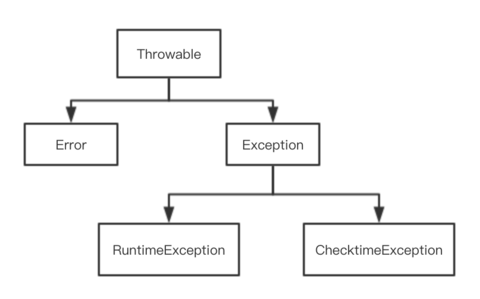

# 异常处理

## 异常处理

* Java 中的异常处理是 Java 提供的用于处理程序中错误的一种机制
* 错误指的是程序「运行」过程中发生的一些异常事件（） 

### **异常的分类**



### **✨异常的处理**

```text
  int[] ages = {1};
  try {
      System.out.println(ages[2]);
  } catch (Exception e) {
      System.out.println("error");
  } finally {
      System.out.println("after error");
  }
```

